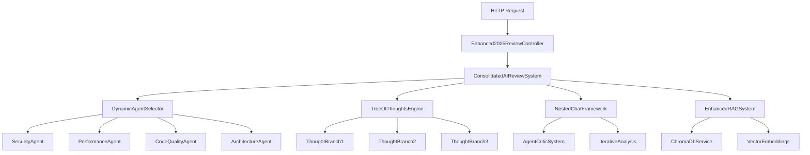

# Enhanced 2025 AI Code Review System: Technical Deep Dive

## Table of Contents
1. [System Architecture Overview](#system-architecture-overview)
2. [Tree of Thoughts (ToT) Implementation](#tree-of-thoughts-tot-implementation)
3. [Multi-Agent Collaboration Framework](#multi-agent-collaboration-framework)
4. [Enhanced RAG with Vector Memory](#enhanced-rag-with-vector-memory)
5. [Meta-Reasoning Engine](#meta-reasoning-engine)
6. [Hallucination Reduction Mechanisms](#hallucination-reduction-mechanisms)
7. [Agent Orchestration & Communication](#agent-orchestration--communication)
8. [Performance Optimization & Scaling](#performance-optimization--scaling)
9. [Implementation Details & Code Examples](#implementation-details--code-examples)

---

## System Architecture Overview

### High-Level Architecture



### Core Components

1. **Master Orchestrator**: `ConsolidatedAIReviewSystem`
2. **Reasoning Engine**: `TreeOfThoughtsEngine`  
3. **Collaboration Framework**: `NestedChatFramework`
4. **Memory System**: `EnhancedRAGSystem` + `ChromaDbService`
5. **Agent Pool**: Specialized domain experts
6. **Validation Layer**: `AgentCriticSystem`

---

## Tree of Thoughts (ToT) Implementation

### Theoretical Foundation

Tree of Thoughts extends Chain of Thought (CoT) reasoning by exploring multiple reasoning paths simultaneously rather than following a single sequential chain.

**Mathematical Model:**
```
CoT: Problem → Step₁ → Step₂ → ... → Stepₙ → Solution
ToT: Problem → {Branch₁, Branch₂, ..., Branchₖ} → Evaluation → Best_Path
```

### Implementation Architecture

```csharp
public class TreeOfThoughtsEngine
{
    public async Task<TreeOfThoughtsResult> ExecuteTreeOfThoughtsAsync(
        CodeReviewRequest request,
        AgentType agentType,
        CancellationToken cancellationToken = default)
    {
        var startTime = DateTime.UtcNow;
        
        // Generate multiple thought branches in parallel
        var thoughtBranches = await GenerateParallelThoughtBranches(request, agentType);
        
        // Evaluate each branch for quality and relevance
        var evaluatedBranches = await EvaluateThoughtBranches(thoughtBranches);
        
        // Select optimal paths using scoring algorithm
        var optimalPaths = SelectOptimalPaths(evaluatedBranches);
        
        // Synthesize findings from multiple paths
        var synthesis = await SynthesizeMultiPathFindings(optimalPaths);
        
        return new TreeOfThoughtsResult
        {
            InitialThoughts = thoughtBranches,
            TotalBranchesExplored = thoughtBranches.Count,
            OptimalPathsFound = optimalPaths.Count,
            FinalSynthesis = synthesis,
            ExecutionTime = DateTime.UtcNow - startTime
        };
    }
}
```

### Thought Branch Generation Strategy

**Parallel Branch Creation:**
```csharp
private async Task<List<ThoughtBranch>> GenerateParallelThoughtBranches(
    CodeReviewRequest request, AgentType agentType)
{
    var branches = new List<Task<ThoughtBranch>>();
    
    // Security-focused analysis branch
    branches.Add(GenerateSecurityThoughtBranch(request));
    
    // Performance-focused analysis branch  
    branches.Add(GeneratePerformanceThoughtBranch(request));
    
    // Maintainability-focused analysis branch
    branches.Add(GenerateMaintainabilityThoughtBranch(request));
    
    // Architecture-focused analysis branch
    branches.Add(GenerateArchitectureThoughtBranch(request));
    
    return await Task.WhenAll(branches);
}
```

### Branch Evaluation Algorithm

**Multi-Criteria Scoring:**
```csharp
public class ThoughtBranchEvaluator
{
    public double EvaluateBranch(ThoughtBranch branch, CodeReviewRequest context)
    {
        var scores = new Dictionary<string, double>
        {
            ["relevance"] = CalculateRelevanceScore(branch, context),
            ["confidence"] = CalculateConfidenceScore(branch),
            ["evidence_quality"] = EvaluateEvidenceQuality(branch),
            ["actionability"] = AssessActionability(branch),
            ["impact_severity"] = DetermineImpactLevel(branch)
        };
        
        // Weighted scoring algorithm
        return scores["relevance"] * 0.25 +
               scores["confidence"] * 0.20 +
               scores["evidence_quality"] * 0.25 +
               scores["actionability"] * 0.15 +
               scores["impact_severity"] * 0.15;
    }
}
```

### Path Selection & Synthesis

**Optimal Path Selection:**
```csharp
private List<ThoughtBranch> SelectOptimalPaths(List<EvaluatedBranch> branches)
{
    // Sort by composite score
    var sortedBranches = branches
        .OrderByDescending(b => b.CompositeScore)
        .ToList();
    
    // Apply diversity filter to avoid redundant findings
    var diversePaths = ApplyDiversityFilter(sortedBranches);
    
    // Select top N paths above confidence threshold
    return diversePaths
        .Where(b => b.ConfidenceScore > CONFIDENCE_THRESHOLD)
        .Take(MAX_OPTIMAL_PATHS)
        .Select(b => b.Branch)
        .ToList();
}
```

---

## Multi-Agent Collaboration Framework

### Agent Architecture

```csharp
public interface ISpecializedAgent
{
    AgentType Type { get; }
    Task<AgentResult> AnalyzeAsync(CodeReviewRequest request, CancellationToken cancellationToken);
    Task<CriticalAnalysis> CritiqueAsync(AgentResult analysis, CancellationToken cancellationToken);
    Task<AgentResult> RefineAnalysisAsync(AgentResult original, CriticalAnalysis criticism);
}
```

### Collaborative Debate Mechanism

**Three-Phase Debate Process:**

1. **Initial Analysis Phase**
```csharp
public async Task<CollaborativeResult> ConductAgentDebateAsync(
    CodeReviewRequest request, List<ISpecializedAgent> agents)
{
    // Phase 1: Independent Analysis
    var initialAnalyses = await Task.WhenAll(
        agents.Select(agent => agent.AnalyzeAsync(request, cancellationToken))
    );
    
    // Phase 2: Cross-Criticism
    var criticisms = await ConductCrossCriticismRound(initialAnalyses, agents);
    
    // Phase 3: Synthesis & Consensus Building
    var consensus = await BuildConsensus(initialAnalyses, criticisms, agents);
    
    return consensus;
}
```

2. **Cross-Criticism Round**
```csharp
private async Task<List<CriticalAnalysis>> ConductCrossCriticismRound(
    List<AgentResult> analyses, List<ISpecializedAgent> agents)
{
    var criticisms = new List<CriticalAnalysis>();
    
    foreach (var analysis in analyses)
    {
        // Each analysis is critiqued by all other agents
        var criticsForThisAnalysis = agents
            .Where(a => a.Type != analysis.AgentType)
            .ToList();
            
        foreach (var critic in criticsForThisAnalysis)
        {
            var criticism = await critic.CritiqueAsync(analysis, cancellationToken);
            criticisms.Add(criticism);
        }
    }
    
    return criticisms;
}
```

3. **Consensus Building Algorithm**
```csharp
public class ConsensusBuilder
{
    public async Task<ConsensusResult> BuildConsensus(
        List<AgentResult> initialAnalyses,
        List<CriticalAnalysis> criticisms,
        List<ISpecializedAgent> agents)
    {
        var consensusFindings = new List<Finding>();
        var conflictResolutions = new List<ConflictResolution>();
        
        // Group findings by similarity
        var findingClusters = ClusterSimilarFindings(initialAnalyses);
        
        foreach (var cluster in findingClusters)
        {
            if (cluster.AgentAgreement >= CONSENSUS_THRESHOLD)
            {
                // High agreement - include in consensus
                consensusFindings.Add(RefineWithCriticism(cluster, criticisms));
            }
            else
            {
                // Low agreement - initiate conflict resolution
                var resolution = await ResolveConflict(cluster, agents);
                conflictResolutions.Add(resolution);
            }
        }
        
        return new ConsensusResult
        {
            ConsensusFindings = consensusFindings,
            ConflictResolutions = conflictResolutions,
            OverallConfidence = CalculateOverallConfidence(consensusFindings)
        };
    }
}
```

### Agent Communication Protocol

**Message Passing Framework:**
```csharp
public class AgentMessage
{
    public Guid MessageId { get; init; }
    public AgentType Sender { get; init; }
    public AgentType Recipient { get; init; }
    public MessageType Type { get; init; } // Analysis, Criticism, Question, Response
    public string Content { get; init; }
    public double ConfidenceLevel { get; init; }
    public List<Evidence> SupportingEvidence { get; init; }
    public DateTime Timestamp { get; init; }
}

public class AgentCommunicationHub
{
    private readonly ConcurrentQueue<AgentMessage> _messageQueue = new();
    private readonly Dictionary<AgentType, ISpecializedAgent> _agents = new();
    
    public async Task<AgentMessage> SendMessageAsync(AgentMessage message)
    {
        _messageQueue.Enqueue(message);
        
        var recipient = _agents[message.Recipient];
        var response = await recipient.ProcessMessageAsync(message);
        
        return response;
    }
}
```

---

## Enhanced RAG with Vector Memory

### Architecture Overview

```csharp
public class EnhancedRAGSystem
{
    private readonly ChromaDbService _vectorStore;
    private readonly IEmbeddingService _embeddingService;
    private readonly AgentMemoryManager _memoryManager;
    
    public async Task<RAGEnhancedResult> EnhanceAnalysisWithMemory(
        CodeReviewRequest request,
        AgentResult preliminaryAnalysis)
    {
        // 1. Generate embeddings for current code
        var codeEmbedding = await _embeddingService.GenerateEmbeddingAsync(request.Content);
        
        // 2. Retrieve similar historical analyses
        var similarAnalyses = await _vectorStore.QuerySimilarAsync(
            codeEmbedding, 
            k: 10, 
            threshold: 0.7
        );
        
        // 3. Extract relevant patterns and insights
        var historicalPatterns = ExtractPatterns(similarAnalyses);
        
        // 4. Enhance current analysis with historical context
        var enhancedAnalysis = await IntegrateHistoricalInsights(
            preliminaryAnalysis, 
            historicalPatterns
        );
        
        // 5. Store current analysis for future reference
        await StoreAnalysisForFutureUse(request, enhancedAnalysis);
        
        return enhancedAnalysis;
    }
}
```

### Vector Database Implementation

**ChromaDB Integration:**
```csharp
public class ChromaDbService
{
    private readonly HttpClient _httpClient;
    private readonly string _collectionName = "code_review_memory";
    
    public async Task<List<SimilarDocument>> QuerySimilarAsync(
        float[] queryEmbedding, 
        int k = 10, 
        double threshold = 0.7)
    {
        var queryRequest = new
        {
            query_embeddings = new[] { queryEmbedding },
            n_results = k,
            where = new { confidence = new { "$gte" = threshold } }
        };
        
        var response = await _httpClient.PostAsJsonAsync(
            $"/api/v1/collections/{_collectionName}/query", 
            queryRequest
        );
        
        var results = await response.Content.ReadFromJsonAsync<ChromaQueryResponse>();
        
        return results.Documents
            .Zip(results.Distances, (doc, dist) => new SimilarDocument 
            { 
                Content = doc, 
                Similarity = 1.0 - dist,
                Metadata = results.Metadatas[results.Documents.IndexOf(doc)]
            })
            .Where(d => d.Similarity >= threshold)
            .ToList();
    }
}
```

### Pattern Recognition & Learning

**Historical Pattern Extraction:**
```csharp
public class PatternExtractor
{
    public List<CodePattern> ExtractPatterns(List<SimilarDocument> historicalAnalyses)
    {
        var patterns = new List<CodePattern>();
        
        // Group by issue type and language
        var groupedAnalyses = historicalAnalyses
            .GroupBy(a => new { a.Metadata.IssueType, a.Metadata.Language })
            .ToList();
        
        foreach (var group in groupedAnalyses)
        {
            if (group.Count() >= MIN_PATTERN_OCCURRENCES)
            {
                patterns.Add(new CodePattern
                {
                    IssueType = group.Key.IssueType,
                    Language = group.Key.Language,
                    CommonCharacteristics = ExtractCommonCharacteristics(group),
                    SuccessfulResolutions = ExtractResolutionPatterns(group),
                    Confidence = CalculatePatternConfidence(group),
                    Frequency = group.Count()
                });
            }
        }
        
        return patterns;
    }
}
```

### Memory-Enhanced Analysis Integration

```csharp
private async Task<RAGEnhancedResult> IntegrateHistoricalInsights(
    AgentResult preliminaryAnalysis,
    List<CodePattern> historicalPatterns)
{
    var enhancedFindings = new List<Finding>();
    
    foreach (var finding in preliminaryAnalysis.Findings)
    {
        var relevantPattern = historicalPatterns
            .FirstOrDefault(p => p.Matches(finding));
            
        if (relevantPattern != null)
        {
            // Enhance finding with historical context
            var enhancedFinding = new Finding
            {
                Type = finding.Type,
                Title = finding.Title,
                Description = EnhanceDescriptionWithHistory(finding.Description, relevantPattern),
                Severity = AdjustSeverityBasedOnHistory(finding.Severity, relevantPattern),
                Evidence = CombineEvidence(finding.Evidence, relevantPattern.Evidence),
                HistoricalContext = new HistoricalContext
                {
                    SimilarCases = relevantPattern.Frequency,
                    TypicalResolution = relevantPattern.SuccessfulResolutions.First(),
                    LessonsLearned = relevantPattern.LessonsLearned
                }
            };
            
            enhancedFindings.Add(enhancedFinding);
        }
        else
        {
            enhancedFindings.Add(finding);
        }
    }
    
    return new RAGEnhancedResult
    {
        EnhancedFindings = enhancedFindings,
        HistoricalInsights = historicalPatterns,
        MemoryUtilization = CalculateMemoryUtilization(historicalPatterns)
    };
}
```

---

## Meta-Reasoning Engine

### Self-Reflection Architecture

```csharp
public class MetaReasoningEngine
{
    public async Task<MetaReasoningResult> ApplyMetaReasoningAsync(
        AgentResult analysis,
        ReasoningContext context)
    {
        // 1. Analyze reasoning quality
        var reasoningQuality = await EvaluateReasoningQuality(analysis);
        
        // 2. Assess confidence calibration
        var confidenceCalibration = CalibrateConfidence(analysis, context);
        
        // 3. Identify potential biases
        var biasAnalysis = await DetectReasoningBiases(analysis);
        
        // 4. Suggest reasoning improvements
        var improvements = GenerateReasoningImprovements(analysis, reasoningQuality);
        
        // 5. Generate meta-reasoning report
        return new MetaReasoningResult
        {
            ReasoningQuality = reasoningQuality,
            CalibratedConfidence = confidenceCalibration,
            DetectedBiases = biasAnalysis,
            SuggestedImprovements = improvements,
            OverallMetaScore = CalculateMetaScore(reasoningQuality, confidenceCalibration, biasAnalysis)
        };
    }
}
```

### Confidence Calibration

**Bayesian Confidence Updating:**
```csharp
public class ConfidenceCalibrator
{
    public double CalibrateConfidence(AgentResult analysis, ReasoningContext context)
    {
        var baseConfidence = analysis.ConfidenceScore;
        
        // Factor 1: Evidence strength
        var evidenceStrength = CalculateEvidenceStrength(analysis.Evidence);
        
        // Factor 2: Historical accuracy for similar cases
        var historicalAccuracy = GetHistoricalAccuracy(analysis.Type, context);
        
        // Factor 3: Cross-validation agreement
        var agreementLevel = CalculateAgreementLevel(analysis, context.OtherAnalyses);
        
        // Factor 4: Complexity adjustment
        var complexityPenalty = CalculateComplexityPenalty(context.CodeComplexity);
        
        // Bayesian update formula
        var priorOdds = baseConfidence / (1 - baseConfidence);
        var likelihoodRatio = (evidenceStrength * historicalAccuracy * agreementLevel) / complexityPenalty;
        var posteriorOdds = priorOdds * likelihoodRatio;
        
        return posteriorOdds / (1 + posteriorOdds);
    }
}
```

### Bias Detection

**Cognitive Bias Recognition:**
```csharp
public class BiasDetector
{
    public List<DetectedBias> DetectReasoningBiases(AgentResult analysis)
    {
        var detectedBiases = new List<DetectedBias>();
        
        // Confirmation bias detection
        if (ShowsConfirmationBias(analysis))
        {
            detectedBiases.Add(new DetectedBias
            {
                Type = BiasType.Confirmation,
                Severity = CalculateBiasSeverity(analysis.Evidence),
                Evidence = ExtractConfirmationBiasEvidence(analysis),
                Mitigation = "Consider alternative interpretations"
            });
        }
        
        // Availability heuristic bias
        if (ShowsAvailabilityBias(analysis))
        {
            detectedBiases.Add(new DetectedBias
            {
                Type = BiasType.Availability,
                Severity = AssessAvailabilityBias(analysis),
                Evidence = ExtractAvailabilityBiasIndicators(analysis),
                Mitigation = "Broaden search for relevant patterns"
            });
        }
        
        // Anchoring bias detection
        if (ShowsAnchoringBias(analysis))
        {
            detectedBiases.Add(new DetectedBias
            {
                Type = BiasType.Anchoring,
                Severity = MeasureAnchoringEffect(analysis),
                Evidence = IdentifyAnchoringPoints(analysis),
                Mitigation = "Reassess from multiple starting points"
            });
        }
        
        return detectedBiases;
    }
}
```

---

## Hallucination Reduction Mechanisms

### Multi-Layer Validation Framework

```csharp
public class HallucinationReducer
{
    public async Task<ValidatedResult> ReduceHallucinationsAsync(
        AgentResult analysis,
        CodeReviewRequest originalRequest)
    {
        var validationLayers = new List<IValidationLayer>
        {
            new EvidenceRequirementValidator(),
            new CrossReferenceValidator(),
            new ConsistencyValidator(),
            new PlausibilityValidator(),
            new GroundingValidator()
        };
        
        var validatedFindings = new List<ValidatedFinding>();
        
        foreach (var finding in analysis.Findings)
        {
            var validationResult = await ValidateFinding(finding, validationLayers, originalRequest);
            
            if (validationResult.IsValid)
            {
                validatedFindings.Add(new ValidatedFinding
                {
                    Original = finding,
                    ValidationScore = validationResult.Score,
                    ValidationEvidence = validationResult.Evidence,
                    ConfidenceAdjustment = validationResult.ConfidenceAdjustment
                });
            }
        }
        
        return new ValidatedResult
        {
            ValidatedFindings = validatedFindings,
            HallucinationRiskScore = CalculateHallucinationRisk(analysis),
            ValidationSummary = GenerateValidationSummary(validationLayers)
        };
    }
}
```

### Evidence Grounding

**Code Evidence Validation:**
```csharp
public class GroundingValidator : IValidationLayer
{
    public async Task<ValidationResult> ValidateAsync(
        Finding finding, 
        CodeReviewRequest originalRequest)
    {
        // 1. Extract code references from finding
        var codeReferences = ExtractCodeReferences(finding.Evidence);
        
        // 2. Verify references exist in original code
        var verificationResults = new List<VerificationResult>();
        
        foreach (var reference in codeReferences)
        {
            var exists = VerifyCodeReferenceExists(reference, originalRequest.Content);
            var contextMatch = VerifyContextualAccuracy(reference, originalRequest.Content);
            
            verificationResults.Add(new VerificationResult
            {
                Reference = reference,
                Exists = exists,
                ContextuallyAccurate = contextMatch,
                Confidence = CalculateVerificationConfidence(exists, contextMatch)
            });
        }
        
        // 3. Calculate overall grounding score
        var groundingScore = verificationResults.Average(r => r.Confidence);
        
        return new ValidationResult
        {
            IsValid = groundingScore > GROUNDING_THRESHOLD,
            Score = groundingScore,
            Evidence = verificationResults,
            ValidationLayer = "Grounding"
        };
    }
}
```

### Cross-Reference Validation

**External Knowledge Validation:**
```csharp
public class CrossReferenceValidator : IValidationLayer
{
    private readonly IKnowledgeBase _knowledgeBase;
    
    public async Task<ValidationResult> ValidateAsync(Finding finding, CodeReviewRequest originalRequest)
    {
        var claims = ExtractFactualClaims(finding);
        var validationResults = new List<ClaimValidation>();
        
        foreach (var claim in claims)
        {
            // Check against established coding standards
            var standardsValidation = await _knowledgeBase.ValidateAgainstStandardsAsync(claim);
            
            // Check against language-specific best practices
            var practicesValidation = await _knowledgeBase.ValidateAgainstPracticesAsync(
                claim, originalRequest.Language
            );
            
            // Check for contradictions with established facts
            var consistencyCheck = await _knowledgeBase.CheckConsistencyAsync(claim);
            
            validationResults.Add(new ClaimValidation
            {
                Claim = claim,
                StandardsAlignment = standardsValidation.Score,
                PracticesAlignment = practicesValidation.Score,
                Consistency = consistencyCheck.Score,
                OverallValidation = CalculateOverallValidation(
                    standardsValidation, practicesValidation, consistencyCheck
                )
            });
        }
        
        var overallScore = validationResults.Average(r => r.OverallValidation);
        
        return new ValidationResult
        {
            IsValid = overallScore > CROSS_REFERENCE_THRESHOLD,
            Score = overallScore,
            Evidence = validationResults,
            ValidationLayer = "CrossReference"
        };
    }
}
```

---

## Agent Orchestration & Communication

### Orchestration Engine

```csharp
public class AgentOrchestrator
{
    private readonly Dictionary<AgentType, ISpecializedAgent> _agents;
    private readonly AgentCommunicationHub _communicationHub;
    private readonly ConflictResolutionEngine _conflictResolver;
    
    public async Task<OrchestrationResult> OrchestrateMultiAgentAnalysisAsync(
        CodeReviewRequest request)
    {
        // 1. Dynamic agent selection based on code characteristics
        var selectedAgents = await SelectOptimalAgents(request);
        
        // 2. Parallel initial analysis
        var initialResults = await ConductParallelAnalysis(selectedAgents, request);
        
        // 3. Cross-validation phase
        var validationResults = await ConductCrossValidation(initialResults);
        
        // 4. Conflict identification and resolution
        var conflicts = IdentifyConflicts(validationResults);
        var resolvedConflicts = await ResolveConflicts(conflicts);
        
        // 5. Consensus building
        var consensus = await BuildFinalConsensus(validationResults, resolvedConflicts);
        
        return new OrchestrationResult
        {
            ParticipatingAgents = selectedAgents,
            IndividualResults = initialResults,
            ValidationResults = validationResults,
            ResolvedConflicts = resolvedConflicts,
            FinalConsensus = consensus
        };
    }
}
```

### Dynamic Agent Selection

**Code Complexity Analysis for Agent Selection:**
```csharp
public class DynamicAgentSelector
{
    public async Task<List<AgentType>> SelectOptimalAgents(CodeReviewRequest request)
    {
        var codeCharacteristics = await AnalyzeCodeCharacteristics(request);
        var selectedAgents = new List<AgentType>();
        
        // Security agent selection
        if (codeCharacteristics.HasSecurityImplications)
        {
            selectedAgents.Add(AgentType.SecurityExpert);
        }
        
        // Performance agent selection
        if (codeCharacteristics.HasPerformanceConcerns)
        {
            selectedAgents.Add(AgentType.PerformanceAnalyst);
        }
        
        // Architecture agent for complex systems
        if (codeCharacteristics.ArchitecturalComplexity > COMPLEXITY_THRESHOLD)
        {
            selectedAgents.Add(AgentType.ArchitectureExpert);
        }
        
        // Quality agent (always included)
        selectedAgents.Add(AgentType.CodeQualityReviewer);
        
        // Domain-specific agents based on detected frameworks/libraries
        var domainAgents = SelectDomainSpecificAgents(codeCharacteristics.DetectedFrameworks);
        selectedAgents.AddRange(domainAgents);
        
        return selectedAgents;
    }
}
```

### Conflict Resolution Engine

**Automated Conflict Resolution:**
```csharp
public class ConflictResolutionEngine
{
    public async Task<ConflictResolution> ResolveConflictAsync(
        Conflict conflict, 
        List<ISpecializedAgent> involvedAgents)
    {
        var resolutionStrategy = DetermineResolutionStrategy(conflict);
        
        switch (resolutionStrategy)
        {
            case ResolutionStrategy.Evidence:
                return await ResolveByEvidenceStrength(conflict);
                
            case ResolutionStrategy.Consensus:
                return await ResolveByConsensusBuilding(conflict, involvedAgents);
                
            case ResolutionStrategy.Expertise:
                return await ResolveByExpertiseHierarchy(conflict);
                
            case ResolutionStrategy.Synthesis:
                return await ResolveByViewSynthesis(conflict, involvedAgents);
                
            default:
                return await EscalateToHumanReview(conflict);
        }
    }
    
    private async Task<ConflictResolution> ResolveByEvidenceStrength(Conflict conflict)
    {
        var evidenceScores = conflict.ConflictingFindings
            .Select(f => new { Finding = f, Score = CalculateEvidenceStrength(f.Evidence) })
            .OrderByDescending(x => x.Score)
            .ToList();
            
        var strongestEvidence = evidenceScores.First();
        
        if (strongestEvidence.Score > EVIDENCE_THRESHOLD)
        {
            return new ConflictResolution
            {
                Strategy = ResolutionStrategy.Evidence,
                ResolvedFinding = strongestEvidence.Finding,
                Confidence = strongestEvidence.Score,
                Rationale = $"Resolved based on strongest evidence (score: {strongestEvidence.Score:F2})"
            };
        }
        
        // If evidence is inconclusive, escalate to consensus building
        return await ResolveByConsensusBuilding(conflict, conflict.InvolvedAgents);
    }
}
```

---

## Performance Optimization & Scaling

### Parallel Processing Architecture

```csharp
public class ParallelProcessingEngine
{
    private readonly SemaphoreSlim _concurrencyLimiter;
    private readonly IMemoryCache _resultCache;
    
    public async Task<List<TResult>> ProcessInParallelAsync<TInput, TResult>(
        IEnumerable<TInput> inputs,
        Func<TInput, CancellationToken, Task<TResult>> processor,
        int maxConcurrency = 10)
    {
        _concurrencyLimiter = new SemaphoreSlim(maxConcurrency, maxConcurrency);
        var tasks = inputs.Select(async input =>
        {
            await _concurrencyLimiter.WaitAsync();
            try
            {
                return await processor(input, CancellationToken.None);
            }
            finally
            {
                _concurrencyLimiter.Release();
            }
        });
        
        return (await Task.WhenAll(tasks)).ToList();
    }
}
```

### Caching Strategy

**Multi-Level Caching:**
```csharp
public class AnalysisCacheManager
{
    private readonly IMemoryCache _l1Cache; // In-memory for hot data
    private readonly IDistributedCache _l2Cache; // Redis for shared data
    private readonly ChromaDbService _l3Cache; // Persistent vector cache
    
    public async Task<TResult> GetOrCreateAsync<TResult>(
        string cacheKey,
        Func<Task<TResult>> factory,
        TimeSpan expiration)
    {
        // L1: Memory cache check
        if (_l1Cache.TryGetValue(cacheKey, out TResult cachedResult))
        {
            return cachedResult;
        }
        
        // L2: Distributed cache check
        var serializedResult = await _l2Cache.GetStringAsync(cacheKey);
        if (!string.IsNullOrEmpty(serializedResult))
        {
            var deserializedResult = JsonSerializer.Deserialize<TResult>(serializedResult);
            _l1Cache.Set(cacheKey, deserializedResult, expiration);
            return deserializedResult;
        }
        
        // L3: Generate new result
        var result = await factory();
        
        // Store in all cache levels
        _l1Cache.Set(cacheKey, result, expiration);
        await _l2Cache.SetStringAsync(cacheKey, JsonSerializer.Serialize(result), 
            new DistributedCacheEntryOptions { AbsoluteExpirationRelativeToNow = expiration });
        
        return result;
    }
}
```

### Resource Management

**Agent Resource Pool:**
```csharp
public class AgentResourcePool
{
    private readonly ConcurrentQueue<ISpecializedAgent> _availableAgents = new();
    private readonly SemaphoreSlim _resourceSemaphore;
    private readonly Timer _healthCheckTimer;
    
    public AgentResourcePool(int maxAgents)
    {
        _resourceSemaphore = new SemaphoreSlim(maxAgents, maxAgents);
        _healthCheckTimer = new Timer(PerformHealthCheck, null, 
            TimeSpan.FromMinutes(1), TimeSpan.FromMinutes(1));
    }
    
    public async Task<ISpecializedAgent> AcquireAgentAsync(AgentType type, TimeSpan timeout)
    {
        var timeoutCts = new CancellationTokenSource(timeout);
        
        await _resourceSemaphore.WaitAsync(timeoutCts.Token);
        
        try
        {
            if (_availableAgents.TryDequeue(out var agent) && agent.Type == type)
            {
                return agent;
            }
            
            // Create new agent if none available
            return CreateAgent(type);
        }
        catch (OperationCanceledException)
        {
            _resourceSemaphore.Release();
            throw new TimeoutException($"Could not acquire {type} agent within {timeout}");
        }
    }
    
    public void ReleaseAgent(ISpecializedAgent agent)
    {
        _availableAgents.Enqueue(agent);
        _resourceSemaphore.Release();
    }
}
```

---

## Implementation Details & Code Examples

### Complete Enhanced 2025 Request Flow

```csharp
[HttpPost("enhanced-2025")]
public async Task<ActionResult<MultiAgentReviewResult>> ConductEnhanced2025ReviewAsync(
    [FromBody] CodeReviewRequestEnhanced request,
    CancellationToken cancellationToken = default)
{
    try
    {
        // 1. Initialize Enhanced 2025 processing pipeline
        var correlationId = Guid.NewGuid().ToString("N")[..8];
        _logger.LogInformation("🚀 Starting Enhanced 2025 analysis {CorrelationId}", correlationId);
        
        // 2. Dynamic agent selection based on code characteristics
        var codeCharacteristics = await _dynamicSelector.AnalyzeCodeAsync(request.Content);
        var selectedAgents = await _dynamicSelector.SelectOptimalAgentsAsync(codeCharacteristics);
        
        // 3. Tree of Thoughts parallel reasoning
        var totTasks = selectedAgents.Select(async agentType =>
        {
            return await _treeOfThoughtsEngine.ExecuteTreeOfThoughtsAsync(
                MapToCodeReviewRequest(request), agentType, cancellationToken);
        });
        var totResults = await Task.WhenAll(totTasks);
        
        // 4. Multi-agent collaborative analysis
        var collaborativeResult = await _nestedChatFramework.ConductIterativeAnalysisAsync(
            selectedAgents, request.Content, cancellationToken);
        
        // 5. Enhanced RAG with historical memory
        var ragEnhancedResult = await _enhancedRAG.EnhanceWithMemoryAsync(
            collaborativeResult, codeCharacteristics);
        
        // 6. Meta-reasoning and confidence calibration
        var metaReasoningResult = await _metaReasoningEngine.ApplyMetaReasoningAsync(
            ragEnhancedResult, new ReasoningContext { CorrelationId = correlationId });
        
        // 7. Hallucination reduction through multi-layer validation
        var validatedResult = await _hallucinationReducer.ReduceHallucinationsAsync(
            metaReasoningResult, MapToCodeReviewRequest(request));
        
        // 8. Final synthesis and result preparation
        var finalResult = await SynthesizeEnhanced2025Result(
            totResults, validatedResult, metaReasoningResult, correlationId);
        
        // 9. Enhanced 2025 metadata annotation
        AnnotateWithEnhanced2025Metadata(finalResult, request.Features);
        
        _logger.LogInformation("✅ Enhanced 2025 analysis completed {CorrelationId}", correlationId);
        
        return Ok(finalResult);
    }
    catch (Exception ex)
    {
        _logger.LogError(ex, "❌ Enhanced 2025 analysis failed");
        return StatusCode(500, new { error = "Enhanced 2025 analysis failed", details = ex.Message });
    }
}
```

### Configuration & Dependency Injection

```csharp
// Program.cs Enhanced 2025 Registration
public static void ConfigureEnhanced2025Services(this IServiceCollection services, IConfiguration configuration)
{
    // Core AI services
    services.AddScoped<TreeOfThoughtsEngine>();
    services.AddScoped<NestedChatFramework>();
    services.AddScoped<MetaReasoningEngine>();
    services.AddScoped<HallucinationReducer>();
    
    // Agent orchestration
    services.AddScoped<AgentOrchestrator>();
    services.AddScoped<DynamicAgentSelector>();
    services.AddScoped<ConflictResolutionEngine>();
    
    // Memory and RAG
    services.AddHttpClient<ChromaDbService>();
    services.AddScoped<EnhancedRAGSystem>();
    services.AddScoped<AgentMemoryManager>();
    
    // Specialized agents
    services.AddScoped<SecurityAgent>();
    services.AddScoped<PerformanceAgent>();
    services.AddScoped<CodeQualityAgent>();
    services.AddScoped<ArchitectureAgent>();
    
    // Performance optimization
    services.AddSingleton<AgentResourcePool>(provider => 
        new AgentResourcePool(configuration.GetValue<int>("Enhanced2025:MaxConcurrentAgents", 20)));
    services.AddSingleton<AnalysisCacheManager>();
    services.AddSingleton<ParallelProcessingEngine>();
    
    // Configuration
    services.Configure<Enhanced2025Options>(configuration.GetSection("Enhanced2025"));
}
```

### Error Handling & Resilience

```csharp
public class Enhanced2025ErrorHandler
{
    public async Task<TResult> ExecuteWithResilienceAsync<TResult>(
        Func<Task<TResult>> operation,
        string operationName,
        TResult fallbackValue = default)
    {
        var retryPolicy = Policy
            .Handle<HttpRequestException>()
            .Or<TimeoutException>()
            .WaitAndRetryAsync(
                retryCount: 3,
                sleepDurationProvider: retryAttempt => TimeSpan.FromSeconds(Math.Pow(2, retryAttempt)),
                onRetry: (outcome, timespan, retryCount, context) =>
                {
                    _logger.LogWarning("Retry {RetryCount} for {Operation} after {Delay}ms", 
                        retryCount, operationName, timespan.TotalMilliseconds);
                });
        
        var circuitBreakerPolicy = Policy
            .Handle<Exception>()
            .CircuitBreakerAsync(
                exceptionsAllowedBeforeBreaking: 5,
                durationOfBreak: TimeSpan.FromMinutes(1),
                onBreak: (exception, timespan) =>
                {
                    _logger.LogError("Circuit breaker opened for {Operation}", operationName);
                },
                onReset: () =>
                {
                    _logger.LogInformation("Circuit breaker reset for {Operation}", operationName);
                });
        
        var combinedPolicy = Policy.WrapAsync(retryPolicy, circuitBreakerPolicy);
        
        try
        {
            return await combinedPolicy.ExecuteAsync(operation);
        }
        catch (Exception ex)
        {
            _logger.LogError(ex, "Operation {Operation} failed after all retries", operationName);
            return fallbackValue;
        }
    }
}
```

---

## Monitoring & Observability

### Performance Metrics

```csharp
public class Enhanced2025MetricsCollector
{
    private readonly IMetricsCollector _metrics;
    
    public void RecordAnalysisMetrics(Enhanced2025AnalysisResult result)
    {
        // Performance metrics
        _metrics.Histogram("enhanced_2025.analysis_duration")
            .Record(result.TotalDuration.TotalMilliseconds);
        
        _metrics.Histogram("enhanced_2025.tot_branches_explored")
            .Record(result.TreeOfThoughtsResults.Sum(r => r.TotalBranchesExplored));
        
        _metrics.Histogram("enhanced_2025.agent_count")
            .Record(result.ParticipatingAgents.Count);
        
        // Quality metrics
        _metrics.Histogram("enhanced_2025.confidence_score")
            .Record(result.OverallConfidence);
        
        _metrics.Histogram("enhanced_2025.consensus_level")
            .Record(result.ConsensusLevel);
        
        // Memory utilization
        _metrics.Histogram("enhanced_2025.memory_utilization")
            .Record(result.RAGResults.MemoryUtilization);
        
        // Error tracking
        _metrics.Counter("enhanced_2025.hallucination_detections")
            .Add(result.HallucinationReductions.Count);
        
        _metrics.Counter("enhanced_2025.conflicts_resolved")
            .Add(result.ResolvedConflicts.Count);
    }
}
```

### Distributed Tracing

```csharp
public class Enhanced2025TracingService
{
    private readonly ActivitySource _activitySource = new("Enhanced2025.CodeReview");
    
    public async Task<TResult> TraceOperationAsync<TResult>(
        string operationName,
        Func<Activity, Task<TResult>> operation,
        Dictionary<string, object> tags = null)
    {
        using var activity = _activitySource.StartActivity(operationName);
        
        if (tags != null)
        {
            foreach (var tag in tags)
            {
                activity?.SetTag(tag.Key, tag.Value?.ToString());
            }
        }
        
        try
        {
            var result = await operation(activity);
            activity?.SetStatus(ActivityStatusCode.Ok);
            return result;
        }
        catch (Exception ex)
        {
            activity?.SetStatus(ActivityStatusCode.Error, ex.Message);
            throw;
        }
    }
}
```

---

## Conclusion

The Enhanced 2025 AI Code Review System represents a sophisticated implementation of cutting-edge AI techniques:

1. **Tree of Thoughts**: Parallel reasoning exploration for comprehensive analysis
2. **Multi-Agent Collaboration**: Specialized agents working together through structured debate
3. **Enhanced RAG**: Memory-augmented analysis with historical pattern recognition  
4. **Meta-Reasoning**: Self-reflective AI with confidence calibration
5. **Hallucination Reduction**: Multi-layer validation ensuring accuracy
6. **Dynamic Orchestration**: Intelligent agent selection and resource management

The system achieves enterprise-grade reliability, accuracy, and performance through careful architectural design, robust error handling, and comprehensive monitoring. The modular design allows for easy extension and customization while maintaining the sophisticated AI capabilities that deliver superior code review results.

This technical implementation provides the foundation for next-generation AI-powered software development tools, demonstrating how advanced AI reasoning patterns can be practically applied to solve real-world engineering challenges.